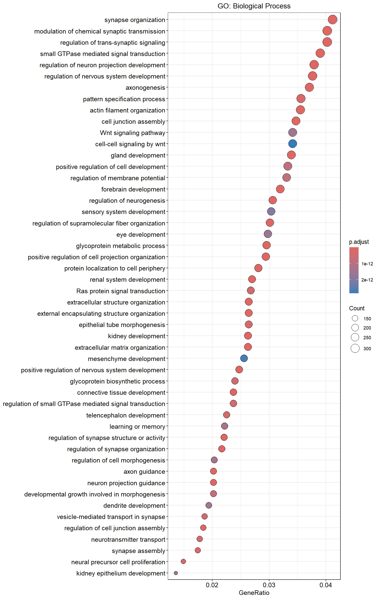

# Gene Expression Analysis of Parkinson’s Disease

## Overview

This project analyzes RNA-Seq data to explore gene expression changes in Parkinson’s disease (PD) resulting from SNCA gene duplication. Using dataset GSE295831, transcriptomic profiles of human iPSC-derived midbrain neurons from individuals with heterozygous SNCA duplication are compared to healthy controls.

### Goal

* Identify differentially expressed genes (DEGs)
* Discover disrupted biological processes and pathways
* Understand molecular mechanisms underlying SNCA-related PD

---

## Dataset

* **Source**: GEO Accession [GSE295831](https://www.ncbi.nlm.nih.gov/geo/query/acc.cgi?acc=GSE295831)
* **Samples**: 8 total (4 PD with SNCA duplication, 4 healthy controls)
* **Model**: iPSC-derived midbrain neurons

---

## Project Objectives

* Identify DEGs between PD (SNCA duplication) and control samples
* Perform functional enrichment (GO, KEGG) analysis
* Reveal insights into PD progression and molecular dysfunction

---

## Methods

### 1. Data Acquisition and Preprocessing

* Downloaded count matrix and metadata via **GEOquery**
* Cleaned metadata using **janitor**, **tidyverse**, **purrr**
* Aligned gene expression with metadata (set GSM IDs as row names)

### 2. Normalization and Transformation

* Normalized raw counts using `estimateSizeFactors()` from **DESeq2**
* Applied **rlog** transformation for variance stabilization

### 3. Clustering and Exploratory Analysis

* **PCA**: Performed using `plotPCA()` and visualized with **ggplot2**
* **Hierarchical Clustering**: Sample-to-sample distance matrix with **pheatmap**
* **Heatmap**: Top 50 DEGs visualized

### 4. Differential Expression Analysis

* Conducted with **DESeq2**:

  * Wald Test: `results(dds, contrast = c("condition", "Disease", "Control"))`
  * Likelihood Ratio Test (LRT): Full (\~condition) vs. Reduced (\~1) models
* Significance Criteria:

  * Adjusted p-value (padj) < 0.05
  * |log2FoldChange| ≥ 0.58 (\~1.5-fold change)
* Applied log2FC shrinkage with `lfcShrink(method = "apeglm")`

### 5. Functional Enrichment Analysis

* Annotated DEGs with **AnnotationDbi**, converted to ENTREZ IDs
* Used **clusterProfiler** for:

  * **GO Enrichment**: `enrichGO()` for Biological Processes (BP)
  * **KEGG Pathway Analysis**: `enrichKEGG()`
* Visualized results with `dotplot()` and `barplot()`

---

## Results

### Sample Clustering

* Clear separation between PD and control samples (PCA, heatmaps)

### Differential Expression

* **Total DEGs**: 10,094

  * **Upregulated**: 5,541 (e.g., ALDH1A1, H19, XIST)
  * **Downregulated**: 4,553 (e.g., PAX2, TLX1, RPH3A)
* **Visualizations**: MA and Volcano plots confirm significant DEGs

### Functional Enrichment


* **GO Terms**: Enriched in synapse organization, neurogenesis, and axon development.

* **KEGG Pathways**: Enriched in Dopaminergic synapse, Neurotrophin signaling, MAPK signaling, and Pathways of neurodegeneration.

### Key Insight

* SNCA duplication disrupts dopaminergic neuron function and activates PD-related pathways

---

## Interpretation

* SNCA duplication causes widespread transcriptional changes in neuron-related genes
* Enriched pathways reflect known PD mechanisms
* Novel upregulated non-coding RNAs (e.g., H19, IGFBP7-AS1) suggest new regulatory insights
* Study confirms known PD-related processes and identifies new targets for further study

---

## Dependencies

### R Packages

* **DESeq2**: Differential expression
* **GEOquery**: Data retrieval
* **janitor, tidyverse, purrr**: Data cleaning
* **ggplot2, pheatmap**: Visualization
* **AnnotationDbi, clusterProfiler**: Functional enrichment

### Other Tools

* R (version ≥ 4.0)
* Bioconductor

---

## Installation

```r
install.packages("BiocManager")
BiocManager::install(c("DESeq2", "GEOquery", "janitor", "tidyverse", "purrr", "ggplot2", "pheatmap", "AnnotationDbi", "clusterProfiler"))
```

---

## Repository

```bash
git clone <https://github.com/Shouryanpatil/Parkinsons-Gene-Expression>
```

---

## Usage

* Download count data and metadata from GSE295831
* Run R scripts in `scripts/` directory
* Results saved in `results/` directory

---

## Future Work

* Validate findings with additional datasets or in vitro models
* Investigate non-coding RNAs as potential biomarkers
* Explore RNA-targeted therapeutic approaches for SNCA-related PD

---

## References

* Kalia, L. V., & Lang, A. E. (2015). Parkinson's disease. *Lancet*, 386(9996), 896–912. [https://doi.org/10.1016/S0140-6736(14)61393-3](https://doi.org/10.1016/S0140-6736%2814%2961393-3)
* Singleton, A. B., et al. (2003). alpha-Synuclein locus triplication causes Parkinson's disease. *Science*, 302(5646), 841. [https://doi.org/10.1126/science.1090278](https://doi.org/10.1126/science.1090278)
* Schneider, Y., et al. (2025). Vimentin network dysregulation mediates neurite deficits in SNCA duplication Parkinson's neurons. *Science Advances*, 11(23), eadq2742. [https://doi.org/10.1126/sciadv.adq2742](https://doi.org/10.1126/sciadv.adq2742)
